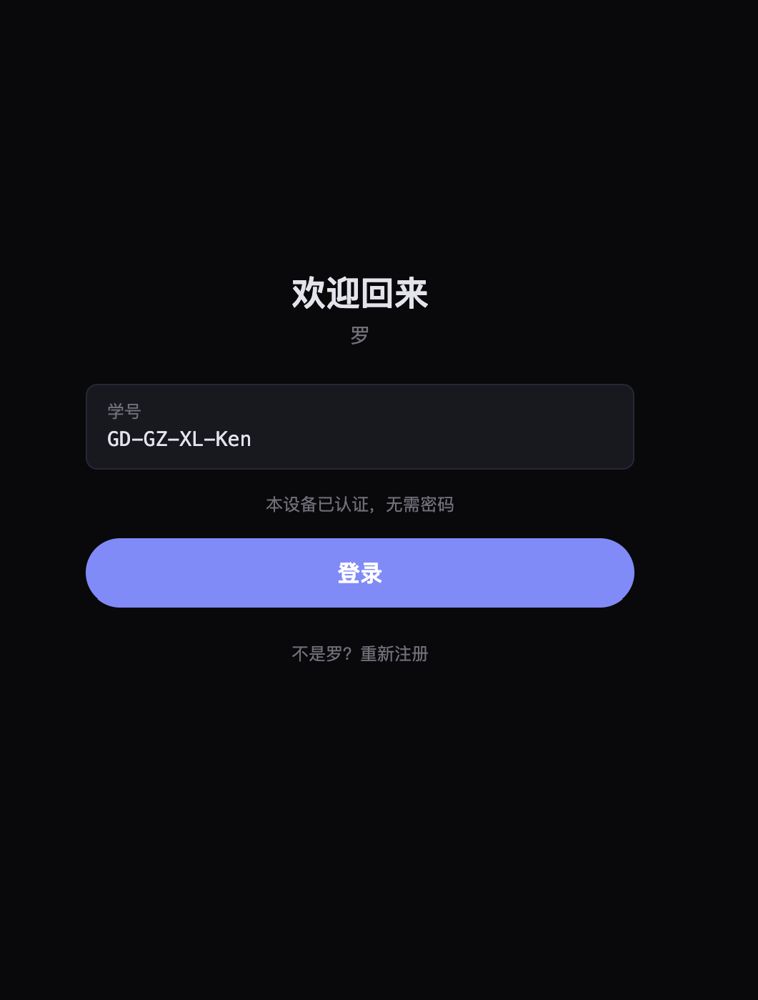
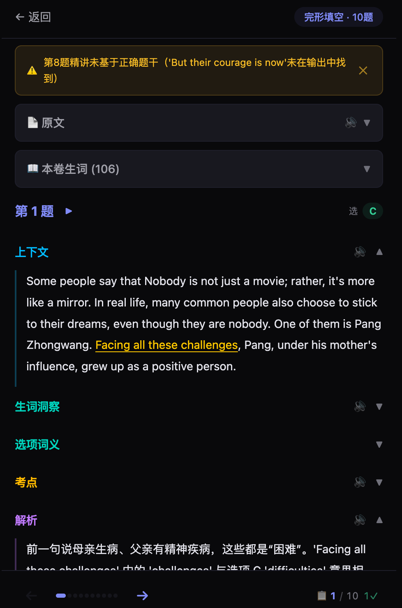
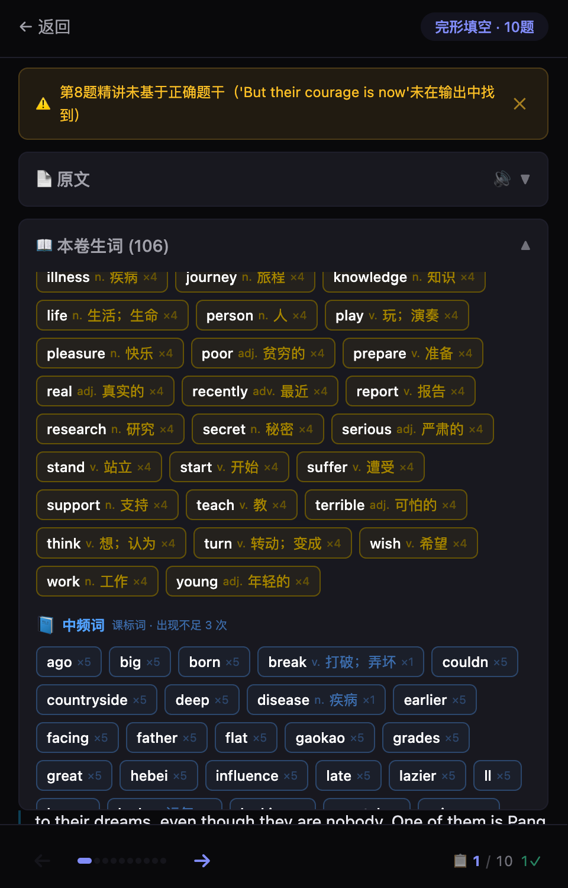
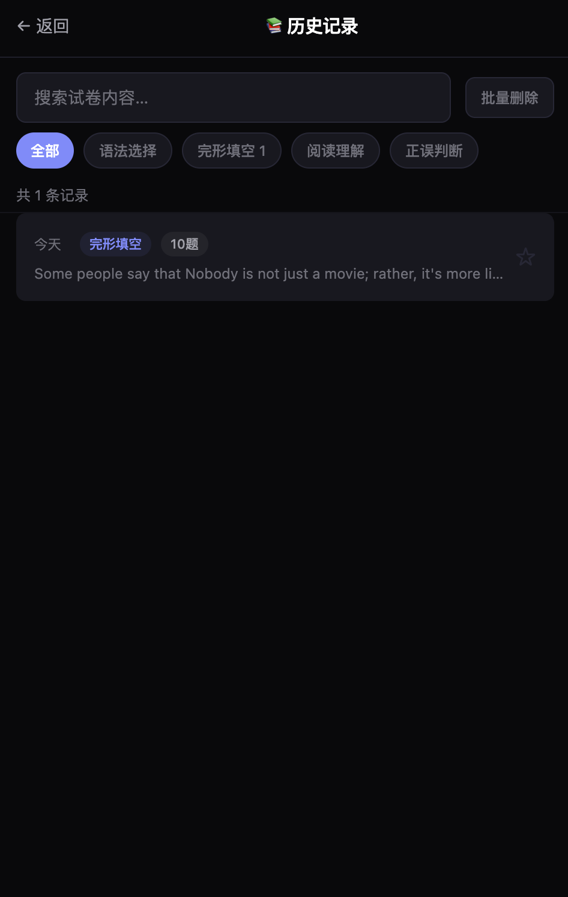
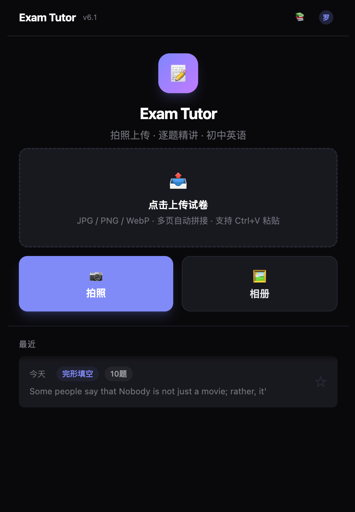
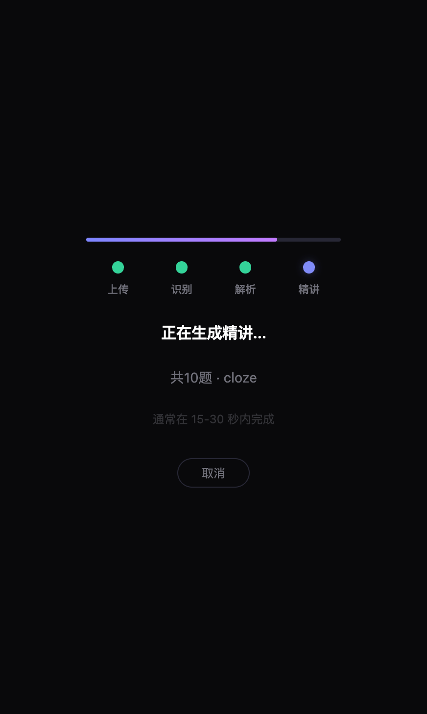
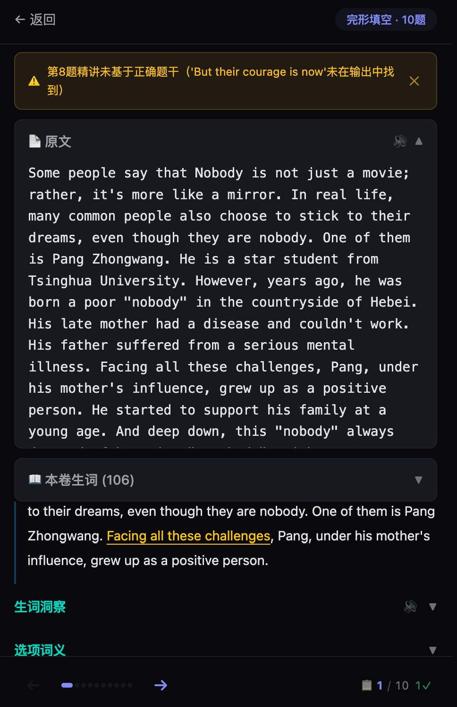
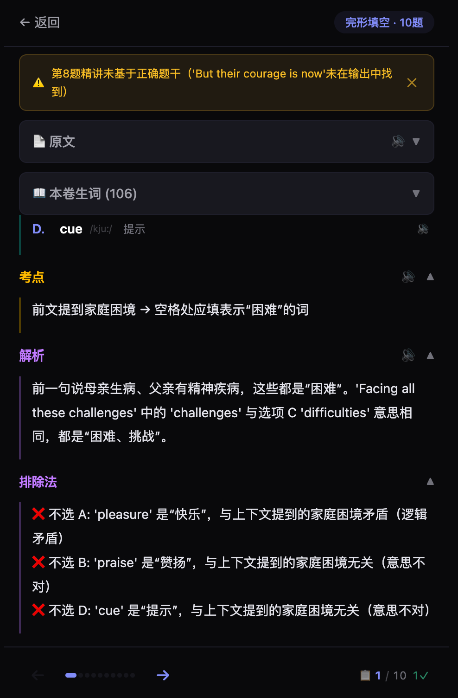
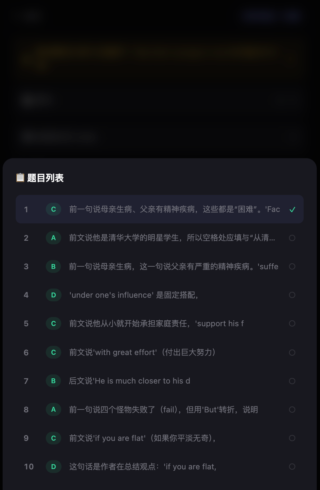

# Exam Tutor — 初中英语试卷精讲

从试卷图片到逐题精讲的完整管线。拍试卷 → 自动识别 → AI 精讲 → 语音朗读。

---

## 预览

| 首页 | 精讲 | 历史 | 解析 |
|:---:|:---:|:---:|:---:|
|  |  |  |  |
| 拍照/上传试卷 | 逐题精讲 + 语音 | 历史记录 + 搜索 | 错题/考点标注 |

---

## 架构

```
图片 → OCR (tesseract) → Stage 1 (deepseek-v4-flash) → Stage 2 (deepseek-chat) → SSE → 前端
                              │                              │
                        试卷结构化解析                    逐题精讲生成
                        Tool: parse_exam                Tool: 5 工具自选
                        strict: true                   strict: true
```

| 组件 | 技术 | 说明 |
|------|------|------|
| OCR | tesseract CLI | 多页拼接 + 质量门（英文占比 ≥ 30%） |
| Stage 1 | deepseek-v4-flash | thinking=disabled, 试卷→结构化 JSON |
| Stage 2 | deepseek-chat | 5 个 Tool 自选，逐题精讲 |
| 前端 | React 19 + Vite 8 + Tailwind CSS 4 | 四屏 SPA + hash 路由 + PWA |
| 存储 | SQLite | 单表，WAL 模式，搜索+筛选索引 |
| 服务 | FastAPI :8080 | 单进程 asyncio |

### 核心流程

1. **拍照/上传** — 手机拍摄或上传试卷图片
2. **OCR 识别** — tesseract 提取文字，质量门过滤低质量图片
3. **Stage 1 解析** — LLM 将 OCR 文本结构化：题型分类 + 题干 + 选项 + 答案
4. **Stage 2 精讲** — LLM 按题型策略逐题生成精讲（含生词、考点、解析、排除法）
5. **SSE 推送** — 逐题精讲结果实时推送前端
6. **语音朗读** — 每道题的解析文字可 TTS 语音朗读

---

## 支持的题型

| 题型 | variant | 精讲模块 |
|------|---------|---------|
| 语法选择 (grammar_cloze) | multiple_choice | 上下文 / 生词洞察 / 选项词义 / 考点 / 解析 / 排除法 |
| 完形填空 (cloze) | multiple_choice | 同上 |
| 开放型填空 | open_ended | 上下文 / 生词 / 考点 / 解析 / 推断思路 |
| 阅读理解 (reading_comp) | multiple_choice | 题干定位 / 选项词义 / 考点 / 解析 / 排除法 |
| 正误判断 (true_false) | multiple_choice | 原句·题干 / 原文依据 / 考点 / 解析 |

---

## 快速开始

```bash
# 1. 安装依赖
pip install -r agent/requirements.txt
sudo apt-get install tesseract-ocr tesseract-ocr-eng

# 2. 安装前端依赖 + 构建
cd frontend && npm install && npm run build && cd ..

# 3. 配置
cp .env.example .env          # 填入 DEEPSEEK_API_KEY
# 编辑 config.yaml 按需调整

# 4. 启动
bash start.sh                  # 自动预检 tesseract + config + 模型可达性
# → http://localhost:8080
```

---

## 项目结构

```
exam-tutor/
├── agent/               # 后端 (FastAPI)
│   ├── main.py          # 服务入口 + API + SSE + CORS
│   ├── engine.py        # 管线编排 (OCR → S1 → S2 → Store)
│   ├── ocr.py           # tesseract CLI 封装 + 质量门
│   ├── tools.py         # 6 个 Tool Definition + 路由表
│   ├── prompts.py       # System/User Prompts
│   ├── store.py         # SQLite CRUD + 搜索/筛选
│   ├── pipeline_log.py  # JSON Lines 管线日志
│   ├── config.py        # YAML 加载 + 门禁 + 参数合并
│   └── requirements.txt
├── frontend/            # React 前端
│   ├── src/
│   │   ├── screens/     # HomeScreen / HistoryScreen / ProcessingScreen / ReviewScreen
│   │   ├── components/  # TopBar
│   │   ├── hooks/       # useTTS / useSSE
│   │   ├── store.jsx    # AppProvider + 全局状态 + hash 路由
│   │   ├── App.jsx      # 路由入口
│   │   └── index.css    # Tailwind + 主题变量
│   ├── vite.config.js   # Vite 配置 + modulePreload + proxy
│   └── package.json
├── webui/               # 前端构建产物（FastAPI StaticFiles 挂载 /）
├── asserts/             # 运行时截图
├── data/                # 运行时数据
│   ├── exams.db         # SQLite 数据库
│   └── pipeline.log     # 管线日志
├── config.yaml          # 唯一配置事实源
├── start.sh             # 一键启动（含预检）
├── .env.example         # 环境变量模板
├── DESIGN.md            # 完整架构设计
├── CHANGELOG.md         # 版本演进记录
└── README.md
```

---

## 设计原则

| # | 原则 |
|---|------|
| 1 | **后端产出已验证的结构化数据，前端只做渲染** |
| 2 | **LLM 的不确定性用架构约束对冲** — Strict Schema + 工具自选 + 语义校验 |
| 3 | **三层 Schema 保证** — Tool JSON Schema → Tool description → System Prompt |
| 4 | **信息边界** — 用户端无模型名、无 API 错误详情、无 endpoint |
| 5 | **质量门分层** — OCR 质量门（硬阻断）/ 结构校验（strict 保证）/ 语义校验（warnings 不阻断） |

→ 完整架构：[DESIGN.md](DESIGN.md) | 版本历史：[CHANGELOG.md](CHANGELOG.md)

---

## 更多截图

| 功能 | 截图 |
|------|:----:|
| 上传处理 |  |
| 逐题精讲(上) |  |
| 精讲详情 |  |
| 历史列表 |  |
| 搜索筛选 |  |
